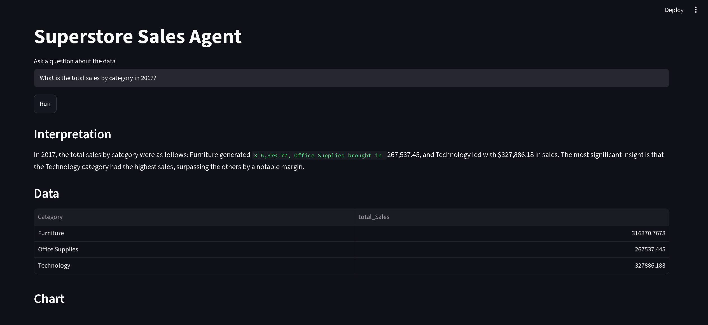
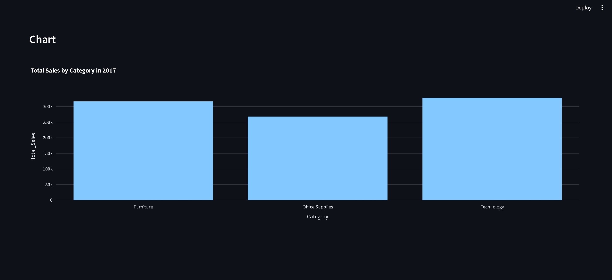

# AI-Powered Data Analysis Agent

A natural language data analysis agent built with LangGraph that converts plain English questions into SQL queries, executes them against a Superstore Sales dataset, and returns results with plain English interpretation and interactive visualizations.

## Architecture

The agent is a LangGraph state machine with the following nodes:

- `parse_question` — extracts structured intent from user question using GPT-4o-mini with structured output
- `generate_sql` — converts parsed intent to SQLite query, with retry logic on failure
- `validate_sql` — checks column and table references against schema before execution
- `execute_query` — runs SQL, returns results as structured data
- `interpret_results` — explains results in plain English
- `generate_visualization` — selects chart type and renders interactive Plotly chart

Self-correction loop: if SQL fails or returns empty results, the agent rewrites the SQL with the error injected into the prompt. Max 3 attempts before returning a failure message.

## Stack

- LangGraph + LangChain
- OpenAI GPT-4o-mini
- SQLite + pandas
- Plotly
- Streamlit

## Setup

1. Clone the repo
```bash
git clone https://github.com/Shadabkhan2004/AI-powered-data-analysis-agent
cd AI-powered-data-analysis-agent
```

2. Create and activate a virtual environment
```bash
python -m venv venv
venv\Scripts\activate  # Windows
```

3. Install dependencies
```bash
pip install -r requirements.txt
```

4. Create a `.env` file in the root directory
```bash
OPENAI_API_KEY=your_api_key_here
```

5. The database is created automatically on first run.

6. Run the app
```bash
streamlit run app.py
```

## Demo




## Example Questions

- What are the top 5 states by total sales in the West region?
- What is the total profit by category in 2017?
- Which customer segment has the highest average discount?
- What are the top 10 products by quantity sold?